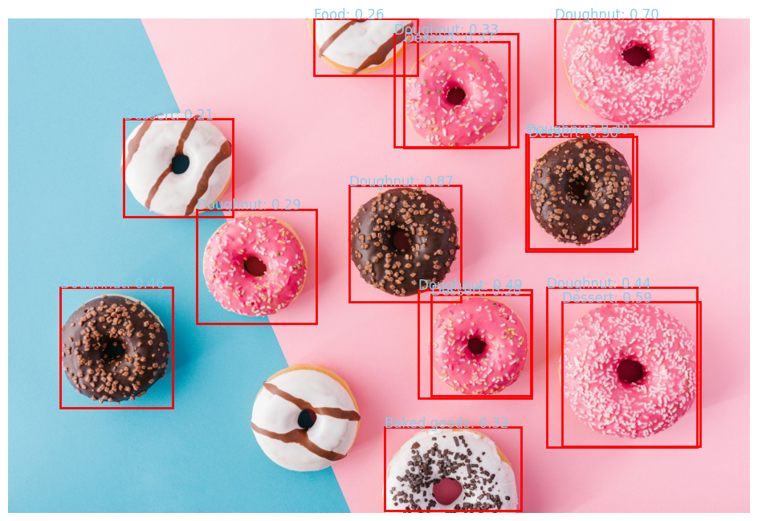

# Object Detection with TensorFlow Hub and OpenCV

This project demonstrates a simple and practical example of object detection using a pre-trained model from TensorFlow Hub, with image processing and visualization via OpenCV and Matplotlib in Google Colab.

## Features

- Loads the Faster R-CNN model from TensorFlow Hub
- Allows user to upload a custom image
- Preprocesses the image for the model
- Runs the model and retrieves detection results (bounding boxes, class names, and confidence scores)
- Draws bounding boxes only for objects with high confidence (threshold is adjustable)
- Displays the output image with bounding boxes and class names

## Requirements

- Google Colab or a Python 3 environment
- The following Python libraries (pre-installed in Colab)
  - tensorflow
  - tensorflow_hub
  - numpy
  - opencv-python
  - matplotlib

## How to Run

1. Open the notebook in Google Colab.
2. Run the first cell to upload an image from your computer.
3. The model will be automatically loaded from TensorFlow Hub.
4. The uploaded image will be processed, and detection results will be visualized.

## Main Code Sections

- Image Upload  
  Uses `files.upload()` to select and upload an image from your computer.

- Image Preprocessing  
  Converts the image to the required format (float32 and batch dimension) for the model.

- Model Loading  
  Loads the Faster R-CNN model from TensorFlow Hub.

- Model Inference  
  Runs the model and retrieves bounding boxes, class names, and confidence scores.

- Drawing Bounding Boxes  
  Only draws boxes for detections with a confidence score above the set threshold (default 0.5).

- Display Output  
  Shows the final image with bounding boxes and detected class names.

## Customization

- Confidence Threshold  
  The default threshold is 0.2. You can change this value to display only detections with higher or lower confidence.

## Example Output

  

## Notes

- If the uploaded image does not display correctly, ensure it is in a supported format.
- If the model fails to load, check your internet connection.

## License

This project is for educational and learning purposes only.