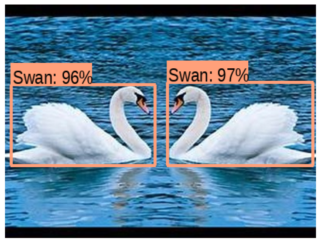

# Object Detection with TensorFlow Hub (Modular Version)

This project demonstrates a modular and extensible approach to **object detection** using a pre-trained model from TensorFlow Hub. The code is organized into reusable functions for downloading, preprocessing, and visualizing detection results on images.

## Features

- Download and resize images from a URL
- Load and run a pre-trained Faster R-CNN model from TensorFlow Hub
- Modular functions for drawing bounding boxes and labels
- Adjustable confidence threshold and maximum number of boxes
- Visualization of detection results with bounding boxes and class names

## Requirements

- Python 3.x
- The following Python libraries:
  - tensorflow
  - tensorflow_hub
  - numpy
  - matplotlib
  - pillow (PIL)

> **Note:** If you are using Google Colab, these libraries are pre-installed.

## How to Run

1. **Set the image URL** in the code or modify it to use your own image.
2. Run the script in Google Colab or your local Python environment.
3. The script will:
    - Download and resize the image
    - Load the object detection model
    - Run inference and draw bounding boxes for detected objects
    - Display the final image with bounding boxes and class labels

## Main Functions

- **display_image(image):**  
  Displays an image using matplotlib.

- **download_and_resize_image(url, new_width, new_height, display):**  
  Downloads an image from a URL, resizes it, and saves it locally.

- **draw_bounding_box_on_image(image, ymin, xmin, ymax, xmax, color, font, display_str_list, thickness):**  
  Draws a bounding box and label on the image.

- **draw_boxes(image, boxes, class_names, scores, max_boxes, min_score):**  
  Draws multiple bounding boxes and labels on the image, filtering by confidence score and limiting the number of boxes.

## Customization

- **Confidence Threshold (`min_score`):**  
  Change the `min_score` parameter in `draw_boxes` to control which detections are shown (default: 0.5).

- **Maximum Boxes (`max_boxes`):**  
  Change the `max_boxes` parameter to limit the number of displayed detections (default: 10).

- **Image URL:**  
  Replace the `image_url` variable with your own image link.

## Example Output

## Notes

- If the font file is not found, the script will use the default font.
- If the image does not display correctly, ensure the URL is valid and the image format is supported.

## License

This project is for educational and learning purposes only.